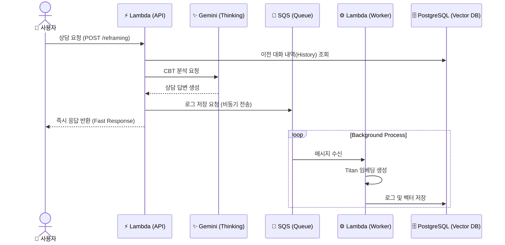

# SAPORI (Caring_Lambda)

> **사회적 약자를 위한 AI 복지 정보 및 멘탈 헬스케어 서비스 백엔드** > AWS Lambda 기반의 Serverless 아키텍처로, RAG 기반 정보 검색과 CBT(인지행동치료) 심리 상담을 제공합니다.

---

## 🚀 주요 기능 (Key Features)

### 1. 🔍 맞춤형 복지/구인 정보 검색 (RAG)
- **Vector Search**: 사용자의 자연어 질문을 **AWS Titan Embeddings v2**로 벡터화하여, `PostgreSQL (pgvector)`에서 가장 연관성 높은 복지 정책 및 장애인 채용 공고를 검색합니다.
- **Context-Aware**: 사용자의 상황(지역, 장애 유무 등)을 고려하여 최적의 정보를 필터링합니다.

### 2. 🧠 CBT 기반 심리 상담 (Reframing)
- **Mental Care**: `Vertax AI`를 활용하여 사용자의 부정적 사고(인지 왜곡)를 분석하고, 건강한 관점으로 전환(Reframing)해줍니다.
- **Socratic Questioning**: 단순 위로가 아닌, 소크라테스식 질문을 통해 사용자 스스로 해답을 찾도록 유도합니다.
- **Context Memory**: `session_id`를 기반으로 대화 맥락을 유지하며 상담을 진행합니다.

### 3. ⚡️ 비동기 로그 및 심리 분석 파이프라인
- **High Performance**: 사용자 응답 속도(Latency)를 보장하기 위해, 상담 로그 저장 및 분석용 임베딩 생성 작업은 **AWS SQS**를 통해 비동기로 처리합니다.
- **Mind Analysis Data**: 상담 내용을 벡터화하여 DB에 적재, 추후 '핵심 신념(Core Belief)' 분석을 위한 데이터를 축적합니다.

---

## 🏗 아키텍처 (Architecture)

### System Flow
사용자의 요청은 **FastAPI (Lambda)**가 처리하며, 무거운 작업(임베딩/DB저장)은 **SQS**를 통해 백그라운드에서 처리됩니다.


---

## 📂 프로젝트 구조 (Directory Structure)

```
Caring_Lambda/
├── chatbot/                  # 메인 챗봇 애플리케이션
│   ├── domain/               # 비즈니스 로직 (Search, Reframing)
│   ├── service/              # 외부 서비스 연동 (LLM, DB, Worker)
│   │   ├── worker_service.py # SQS 메시지 처리 워커
│   │   └── ...
│   ├── schema/               # Pydantic 데이터 모델 (Request/Response)
│   ├── prompts/              # AI 프롬프트 템플릿
│   ├── lambda_function.py    # Lambda 진입점 (Dispatcher)
│   └── main.py               # FastAPI 앱 정의
│
├── welfare-data-ingestor/    # 복지 데이터 수집/적재 (Batch)
│   ├── app/fetcher/          # 외부 공공데이터 API 연동
│   └── ...
│
└── webHook/                  # 유틸리티 (Discord 알림 등)
```

## 🔧 환경 변수 설정 (Environment Variables)
배포 시 AWS Lambda 환경 변수에 다음 값들이 설정되어야 합니다.

### Database
- DB_HOST: RDS 엔드포인트
- DB_NAME: 데이터베이스 이름
- DB_USER / DB_PASSWORD: 접속 계정 정보

### AI Services
- GCP_SSM_PARAM_NAME: Google Vertex AI 인증 정보가 담긴 SSM 파라미터 이름
- BEDROCK_MODEL_ID: amazon.titan-embed-text-v2:0

### Async Queue
- CBT_LOG_SQS_URL: 로그 저장용 SQS Queue URL

## 🚀 배포 (Deployment)
- 이 프로젝트는 GitHub Actions를 통해 CI/CD 파이프라인이 구축되어 있습니다.  
- chatbot/ 디렉토리 변경 시: deploy-chatbot.yml 실행  
- welfare-data-ingestor/ 디렉토리 변경 시: deploy-welfare-data-ingestor.yml 실행
